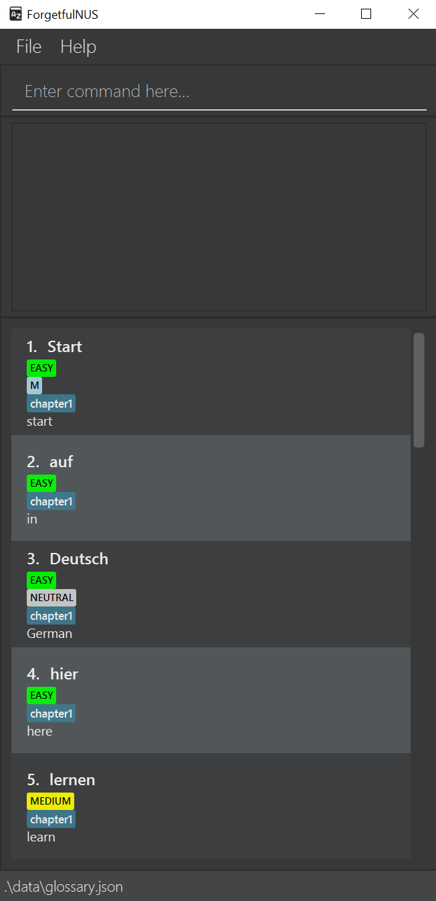
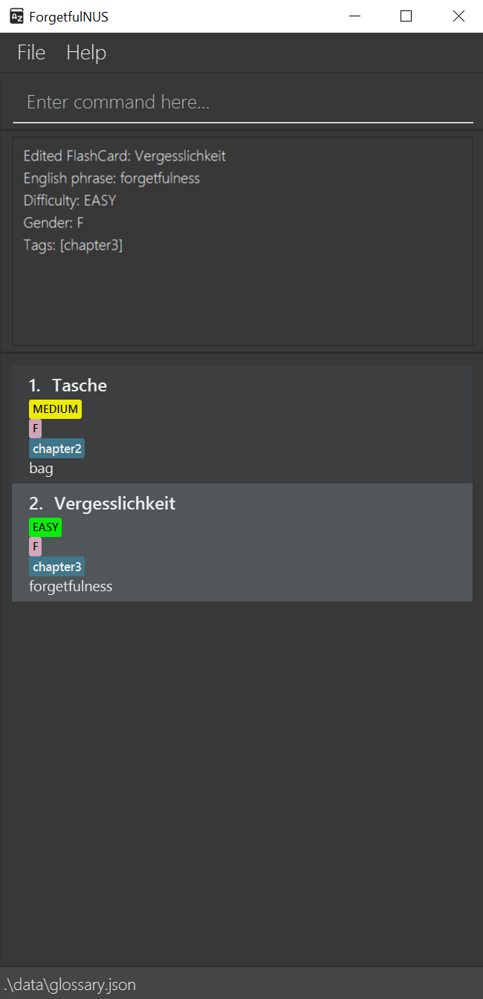
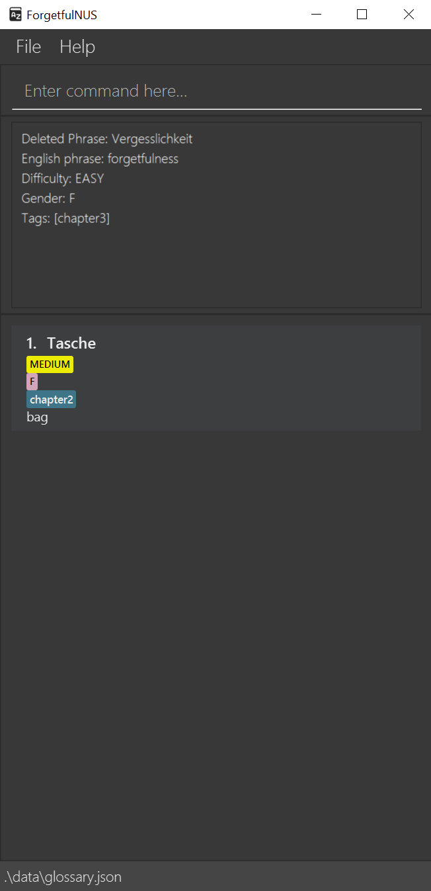
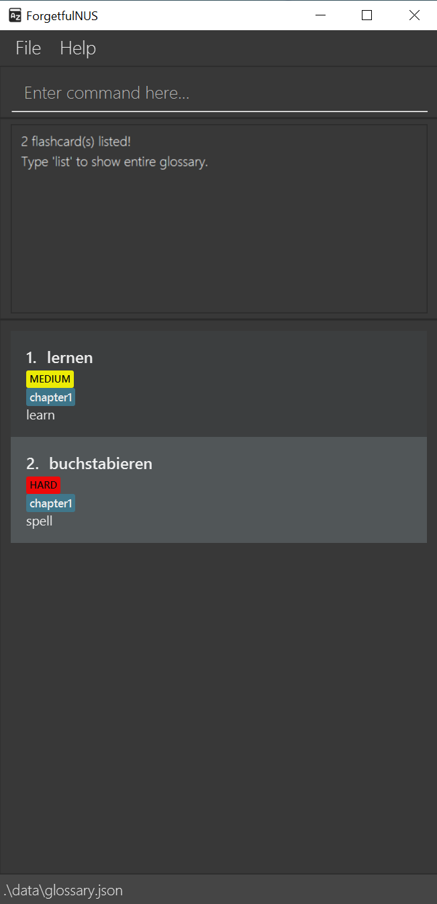
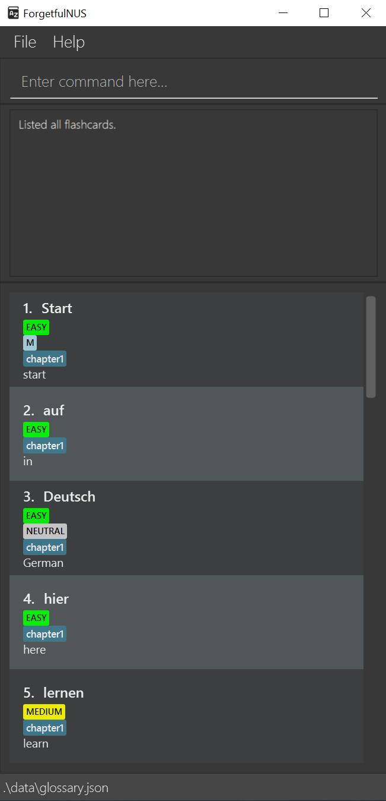

ForgetfulNUS is a desktop glossary app for students taking German 1 (LAG1201)
and German 2 (LAG2201) in NUS to practise and test their vocabulary. This app is optimised
for use via a Command Line Interface (CLI). If you can type fast, ForgetfulNUS 
can get your German revision done quickly and effectively.

## Table of Contents

1. [Quick Start](#qs)
1. [Commonly used Commands](#cucmds)
1. [Features](#features)
    1. [Edit the glossary](#editing)
        1. [Add a Flashcard](#add) : `add`
        1. [Edit a Flashcard](#edit) : `edit`
        1. [Delete a Flashcard](#delete) : `delete`
        1. [Clear All Flashcards](#clear) : `clear`
    1. [Test Yourself](#test)
        1. [Normal Test](#quiz) : `quiz`
        1. [Try](#try) : `try`
        1. [Next](#next) : `next`
        1. [End Testing](#end) : `end`
        1. [Random Test](#random) : `random`
        1. [View Past Scores](#scores) `scores`
        1. [Reset Scores](#reset_scores) `reset scores`
    1. [Navigate the glossary](#navigating)
        1. [Find a Flashcard](#find) `find`
        1. [List All Flashcards](#list) `list`
        1. [Sort All Flashcards](#sort) `sort`
    1. [Miscellaneous Commands](#misc)
        1. [Help](#help) `help`
        1. [Exit](#exit) `exit`
1. [FAQ](#faq)
1. [Command Summary](#cmdsum)

--------------------------------------------------------------------------------------------------------------------

## 1. Quick Start

1. Ensure you have Java `11` or above installed in your Computer.

1. Download the latest `ForgetfulNUS.jar` from [here](https://github.com/AY2021S1-CS2103T-W16-2/tp/releases).

1. Copy the file to the folder you want to use as the _home folder_ for your ForgetfulNUS.

1. Double-click the file to start the app. When it first starts up, ForgetfulNUS should look similar to the figure below. ForgetfulNUS contains some pre-loaded
 sample data for you to get started.  
   

1. Type the command in the command box and press Enter to execute it. e.g. typing **`help`** and pressing Enter will open the help window. 

## 2. Commonly Used Commands
  
   Here are some example commands you can try:

   * **`add`**`g/Vergesslichkeit e/Forgetfulness` : Adds a flashcard with German phrase `Vergesslichkeit` with English translation `Forgetfulness` to the glossary.

   * **`quiz`** : Starts a round of vocabulary testing with all existing flashcards in the glossary.
   
   * **`try`**`start` : Attempt "start" as the the answer to a German Phrase while quizzing. 

   * **`end`** : Ends a round of vocabulary testing.

   * **`exit`** : Exits the app.

Refer to the [Features](#features) below for a full list of commands 
with additional details.

--------------------------------------------------------------------------------------------------------------------

## 3. Features

**:information_source: Notes about the command format:** 

* Words in `UPPER_CASE` are the parameters to be supplied by the user. 
  e.g. in `add g/<GERMAN PHRASE> e/<ENGLISH PHRASE>`, `GERMAN PHRASE` and `ENGLISH PHRASE` are parameters which can be used as `add g/Vergesslichkeit e/Forgetfulness`.
  
* Items with `...` after them can be used multiple times including zero times.
  e.g. `g/<GERMAN PHRASE> [t/<TAG>]...` can be used as  (i.e. 0 times), t/objects, t/objects t/nouns etc.
  

* Items in `[]`, square brackets, are optional.
  e.g `g/<GERMAN PHRASE> [t/<TAG>]` can be used as g/Vergesslichkeit t/tutorialOne or as g/Vergesslichkeit.
  
* For commands using prefixes, only one or zero prefixes are allowed, except for `TAG`.

* Commands are case-insensitive e.g. `Add` or `ADD` will be accepted as `add` too.

### 3.1. Edit the glossary
#### 3.1.1. Add a flashcard: `add`

Adds a flashcard to the glossary. You can use this to expand your glossary.

Format: `add g/<GERMAN PHRASE> e/<ENGLISH PHRASE> [d/<DIFFICULTY>] [s/<GENDER>] [t/<TAG>]...}`

**:information_source: Notes about add command:** 

* Difficulty has only three states, EASY, MEDIUM and HARD.
  If left blank, by default it will be MEDIUM.
  
* Gender has only four states, M (Masculine), F (Feminine), NEUTRAL or NONE.
  If left blank, by default it will be NONE.
  
* Tags that are **not** predefined should be alphanumeric and not contain spaces.
  

Example:
* `add g/Vergesslichkeit e/forgetfulness d/hard s/f t/extra`

After entering this command, your app should look like this:

#### 3.1.2. Edit a flashcard: `edit`

Edits a flashcard in the glossary at the specified `INDEX`.

Format: `edit INDEX [g/<GERMAN PHRASE>] [e/<ENGLISH PHRASE>] [d/<DIFFICULTY>] [s/<GENDER>] [t/<TAG>]...}`

* Edits the flashcard at the specified `INDEX`. The index refers to the index number shown in the displayed flashcard list. The index **must be a positive integer** 1, 2, 3, ...
* At least one of the optional fields must be provided.
* Existing values will be updated to the input values.
* When editing tags, the existing tags of the flashcard will be removed i.e adding of tags is not cumulative.
* You can remove all the flashcard’s tags by typing `t/` without
    specifying any tags after it.

Example:
* `edit d/easy t/chapter3`

After entering this command, your app should look like this:

#### 3.1.3. Delete a flashcard : `delete`

Deletes the specified flashcard from the glossary permanently. You can use this command to delete flashcards you consider outdated or not relevant to your learning. 

Format: `delete <INDEX>`

* Deletes the flashcard at the specified `INDEX`.
* The index refers to the index number shown in the displayed glossary.
* The index **must be a positive integer** 1, 2, 3, …​

Example:
* `delete 2` deletes the 2nd flashcard in the glossary.
 
After entering this command, your app should look like this:

#### 3.1.4. Clear all Flashcards : `clear`

Deletes all flashcards from the glossary permanently. This can be useful if you want to remove all default flashcards and start from scratch.

Format: `clear`

After entering this command, your app should look like this:

### 3.2. Test Yourself
#### 3.2.1. Normal Test : `quiz`

Starts a round of vocabulary testing with all the flashcards that are currently in the glossary. The English translations for every flashcard are now hidden for the user to self-test. You can use this command to test if you remember the definition corresponding to the German phrase on the flashcards.

Format: `quiz`

After entering this command, your app should look like this:

#### 3.2.2. Try : `try`
Compares the user attempt with the definition of the current flashcard. You can use this command when the app asks you to enter the definition on a flashcard. If the attempt is correct, the quiz will move on to the next flashcard. If the attempt is not correct, users will be prompted to try again or skip this card.

Format: `try <ATTEMPT>`

Example: 'try start'

After entering this command, your app should look like this:

#### 3.2.3. Next : `next`
Skips the current flashcard and move on to the next card in quiz mode. You can use this command if you cannot get the correct answer but wish to continue with the quiz. The current flashcard will be considered incorrectly answered.

Format: `next`

After entering this command, your app should look like this:

#### 3.2.4. End Quiz : `end`

Ends the round of vocabulary testing. You can use this anytime during the quiz and the quiz score will be the number of correct attempts to that point.

Format: `end`

After entering this command, your app should look like this:

#### 3.2.5. Random Test : `random`

Starts a round of vocabulary testing like the previous quiz command but with the specified number of flashcards randomly selected from the existing glossary. You can use this command when you want a quick, randomised quiz where you can decide the number of questions.

Format: `random <NUMBER>`

Example: 
* `random 4` starts a randomised quiz with 4 randomly selected flashcards.
    
After entering this command, your app should look like this:
    

Note that screenshot might not look exactly the same on your end as flashcards are randomised.

#### 3.2.6. View Past Scores : `scores`

Displays a history of scores from past quizzes. Along with each score, the 
German phrases tested in the corresponding round are also listed. This way, you can
identify groups of German phrases you struggle with, and track your progress.

Format: `scores`

**:information_source: Notes about saving scores:** 

* For each unique list of German phrases, only the most recent score is saved. If you decide to test
yourself on the same list again, your previous score will be overwritten.
* Scores are automatically saved after a quizzing round ends, and no further action on your part is needed.

**:information_source: Notes about viewing scores:** 
* For easy reference, scores are listed starting from the most recently added score.
  In the case of re-testing yourself on the same list, the score is considered to be overwritten and not
  added, so the original list position is retained. 

After entering this command, your app should look like this:

#### 3.2.7. Reset Scores : `reset scores`

Permanently deletes the history of saved scores, including all scores saved in past sessions.

Format: `reset scores`

After entering this command, your app should look like this:

### 3.3. Navigate the glossary

These commands allow you to manipulate the glossary so you can find certain phrases more easily.

#### 3.3.1. Find a Flashcard : `find`

Finds certain flashcard(s) according to the **German phrase** entered. You can enter more german phrases after the first phrase to search for more flashcards corresponding to your search parameters. **The full German phrase must be entered for each parameter**. To view the full Glossary again, see [List all Flashcards](#list) below.

Format: `find <GERMAN PHRASE> <OPTIONAL GERMAN PHRASE 1> <OPTIONAL GERMAN PHRASE 2>...`

Examples:
* `find lernen buchstabieren` finds the flashcards with the German Phrases 'lernen' and 'buchstabieren'.
    
After entering this command, your app should look like this:

#### 3.3.2. List All Flashcards : `list`

Displays all flashcards in the glossary. You can use this command to return to the full glossary after a find operation.

Format: `list`

After entering this command, your app should look like this:

### 3.3.3. Sort All Flashcards : `sort`

Sorts the all flashcards according to the way you choose. You may find this helpful for browsing the flashcards or changing the order for quiz mode.

Format: `sort <PARAMETER>`

* `<PARAMETER>` refers to how you want to sort the flashcards by.
* Possible parameters:
    1. `german`: sorts by the alphabetical order of German phrases.
    1. `english`: sorts by the alphabetical order of English definitions.
    1. `reversegerman`: sorts by the reverse alphabetical order of German phrases.
    1. `reverseenglish`: sorts by the reverse alphabetical order of English phrases.
    1. `easytohard`: sorts by difficulty of flashcards, from easy to hard.
    1. `hardtoeasy`: sorts by difficulty of flashcards, from hard to easy.
    1. `earliest`: sorts by chronological order, from the earliest flashcard added to the latest. This is also the initial sort order.
    1. `latest`: sorts by chronological order, from the latest flashcard added to the earliest.

**:information_source: Notes about adding a phrase:** 

* Upon adding a new phrase, it will automatically be added to the bottom
  of the glossary regardless of the current sorted order. You will have to sort 
  the glossary again to update it with the newly added phrase. 
  

Examples:
* `sort hardtoeasy` sorts the flashcards by their respective difficulty tags from "hard" to "easy".

After entering this command, your app should look like this:

### 3.4. Miscellaneous Commands
#### 3.4.1. Help : `help`

Opens a small window containing a link to this User Guide. You can use this command to quickly access the User Guide, such as when you need to refer to the command formats or how to run the app. **This requires an Internet connection.**

Format: `help`

#### 3.4.2 Exit the program : `exit`

Saves and exits the program. If this command is used during a quizzing round, the score
up to that point will be saved.

Format: `exit`

--------------------------------------------------------------------------------------------------------------------

## 4. FAQ

**Q**: Do I need to save my data manually? 
**A**: ForgetfulNUS glossary data is automatically saved in the hard disk upon exiting. There is no need to save manually.

**Q**: How do I transfer my data to another Computer? 
**A**:
1. Install the app in your other computer.
1. Locate the `data` folder in your previous ForgetfulNUS home folder, and find the `glossary.JSON` file inside.
1. Transfer the `glossary.JSON` file to your new computer
1. Place the `glossary.JSON` file in the `data` folder of the ForgetfulNUS home folder in your other computer.

--------------------------------------------------------------------------------------------------------------------

## 5. Command Summary

Action | Format, Examples
--------|------------------
**Add** | `add g/<GERMAN PHRASE> e/<ENGLISH PHRASE> [d/<DIFFICULTY>] [s/<GENDER>] [t/<TAGS>...]`   e.g., `add g/Vergesslichkeit e/Forgetfulness d/hard`
**Delete** | `delete INDEX`   e.g., `delete 3`
**Clear** | `clear`
**Start Normal Quiz** | `quiz`
**Start Random Quiz** | `random <NUMBER>`   e.g., `random 5`
**Next phrase** | `next`
**Try an answer** | `try <ATTEMPT>`   e.g., `try Tuesday`

Action | Format, Examples
--------|------------------
**End Quiz** | `end`
**View Past Scores** | `scores`
**Reset Scores** | `reset scores`
**Find** | `find <GERMAN PHRASE>`   e.g., `find Vergesslichkeit`
**List** | `list`
**Sort** | `sort <PARAMETER>`   e.g., `sort english`
**Help** | `help`
**Exit** | `exit`
